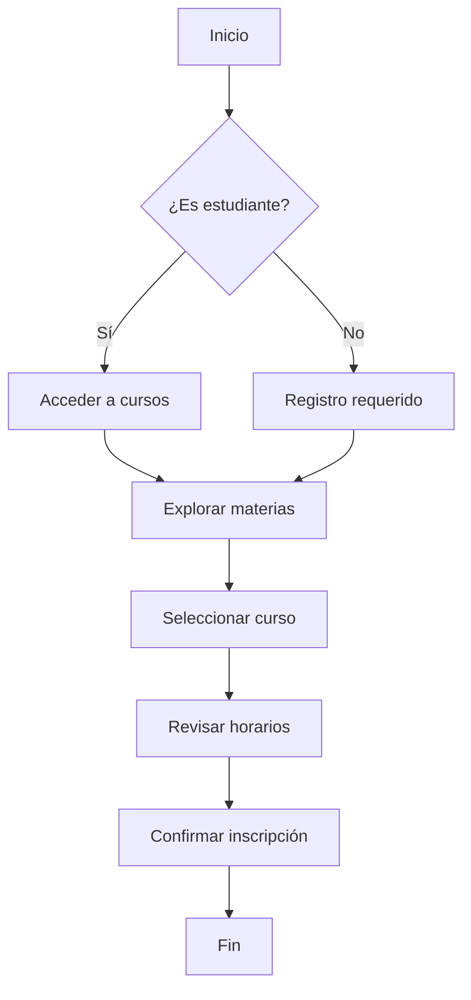
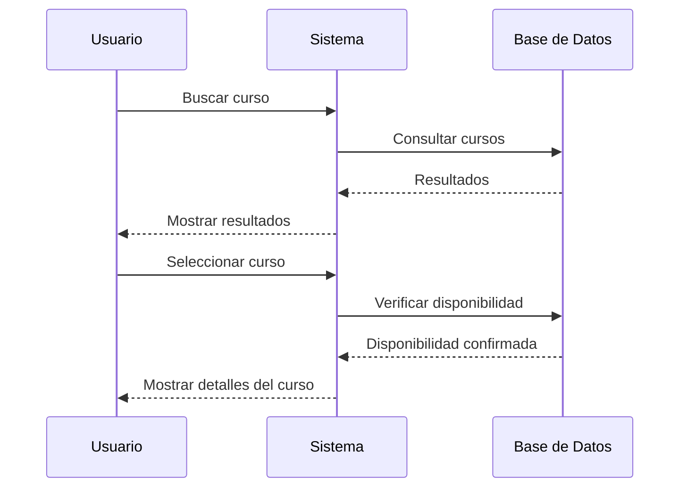
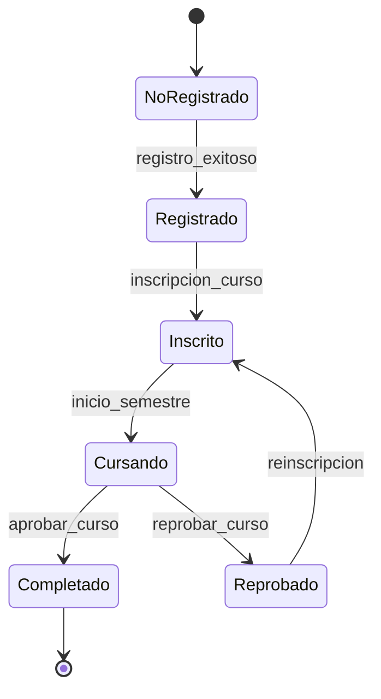

# Ejemplo de uso de Mermaid en MarkdownTextView

Este documento demuestra cómo el componente `MarkdownTextView` ahora soporta diagramas Mermaid.

## Diagrama de flujo



## Diagrama de secuencia



## Diagrama de estado



## Diagrama de clases

```mermaid
classDiagram
    class Usuario {
        +String nombre
        +String email
        +String id
        +login()
        +logout()
    }

    class Curso {
        +String codigo
        +String nombre
        +Int creditos
        +String horario
        +inscribir(usuario)
        +obtenerDetalles()
    }

    class Inscripcion {
        +Date fechaInscripcion
        +String estado
        +confirmar()
        +cancelar()
    }

    Usuario ||--o{ Inscripcion
    Curso ||--o{ Inscripcion
```

## Texto normal

Este es texto normal que aparece después de los diagramas Mermaid para verificar que el resto del contenido se renderiza correctamente.

- Lista de elementos
- Otro elemento
- Un tercer elemento

Y aquí hay un poco de código inline: `console.log('Hello World')`

```javascript
// Y un bloque de código normal
function saludar(nombre) {
	return `Hola, ${nombre}!`
}
```
