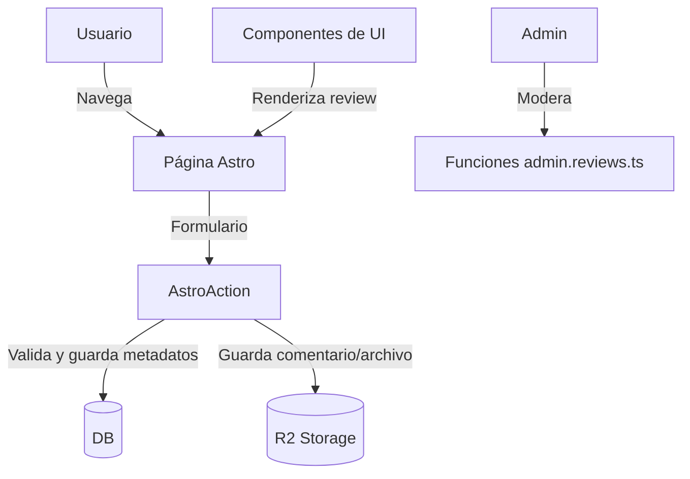

# Arquitectura y Funcionamiento Interno

Bienvenido a la documentación técnica de **BuscaRamos**. Aquí encontrarás una visión clara y conectada de cómo funciona la plataforma por dentro: desde la estructura de carpetas, el flujo de datos y el manejo de reseñas, hasta el rol de las AstroActions y la administración de contenido. Todo está pensado para ser mobile-first, accesible y fácil de mantener.

## Estructura de Carpetas

La organización del código sigue buenas prácticas para proyectos Astro modernos:

```plaintext
src/
  pages/         # Rutas y páginas Astro (vistas, endpoints y API)
  components/    # Componentes reutilizables y específicos (UI, reviews, formularios)
  layouts/       # Layouts base para páginas
  content/       # Contenido en MDX, JSON, Markdown (blogs, recursos, agradecimientos)
  lib/           # Utilidades, lógica de negocio y acceso a datos
  data/          # Datos estructurados (etiquetas, metadatos, siteData)
  styles/        # Estilos globales y utilidades Tailwind
```

## Flujo de Trabajo General

1. El usuario navega a una página (ej: `/catalog`, `/[sigle]/review`).
2. Astro renderiza la vista desde `src/pages/` y compone la UI con componentes de `src/components/`.
3. Cuando el usuario interactúa (por ejemplo, envía una reseña), la información viaja a una **AstroAction** (en `src/actions/`).
4. Las AstroActions validan, autentican y procesan la petición, accediendo a la base de datos D1 (para metadatos) y a R2 (para comentarios largos o archivos).
5. El contenido estático (blogs, recursos, agradecimientos) vive en `src/content/` y se muestra usando componentes y layouts.
6. Todo el diseño es mobile-first, usando Tailwind CSS v4 y los breakpoints personalizados `tablet:` y `desktop:` para una experiencia óptima en cualquier dispositivo.

---

## Manejo y Almacenamiento de Reseñas

Las reseñas de cursos son uno de los pilares de BuscaRamos. El flujo es el siguiente:

- **Creación/Edición:**
  - Los usuarios pueden crear o editar reseñas desde `/[sigle]/review`.
  - El formulario permite valorar el curso, indicar dificultad, tipo de asistencia, horas semanales, año, semestre y agregar un comentario.

- **Almacenamiento:**
  - Los metadatos (valoración, dificultad, etc.) se guardan en la base de datos D1, tabla `course_reviews`.
  - El comentario largo se almacena como archivo markdown en R2 (object storage tipo S3). La ruta al archivo (`comment_path`) queda registrada en la base de datos.

- **Recuperación y visualización:**
  - El endpoint `/api/reviews?path=...` recupera el comentario markdown desde R2 usando la ruta almacenada.
  - El contenido se muestra en la UI usando componentes como `MarkdownReviewView` (React) o `MarkdownTextView` (Astro).

- **Moderación y administración:**
  - Funciones en `src/lib/server/admin.reviews.ts` permiten listar, aprobar, ocultar y obtener estadísticas de reseñas.
  - Solo usuarios con permisos especiales pueden acceder a la administración.

---

## Almacenamiento de Contenido

- **Reviews:**
  - Comentarios extensos en R2, metadatos en la base de datos D1.
- **Contenido estático:**
  - Blogs, agradecimientos y recursos en `src/content/` como MDX, JSON o Markdown.
- **Datos estructurados:**
  - Etiquetas, metadatos y configuraciones en `src/data/`.

---

## AstroActions: Seguridad y Flujo de Datos

Las **AstroActions** son el "puente seguro" entre la interfaz de usuario y los datos en BuscaRamos. Permiten que todas las operaciones importantes (crear, editar, eliminar, moderar) sean validadas y autenticadas en el servidor, cuidando la integridad y privacidad de la comunidad.

- **¿Dónde viven?**  
  En `src/actions/index.ts` y archivos relacionados.
- **¿Qué hacen?**
  - Reciben datos de formularios desde la UI.
  - Validan los datos usando Zod.
  - Verifican autenticación y permisos del usuario.
  - Ejecutan operaciones sobre la base de datos D1 y el almacenamiento R2.
  - Devuelven respuestas estructuradas para la UI.
  - Ejemplo: crear/editar reseñas, blogs, recomendaciones, reportar o moderar contenido.
- **¿Por qué son importantes?**  
  Centralizan el flujo de datos, refuerzan la seguridad y simplifican el mantenimiento. Así, la información sensible nunca queda expuesta en el cliente y se protege la experiencia de la comunidad.

---

## Diagrama de Interacción Simplificado

El siguiente diagrama resume cómo interactúan los distintos componentes y servicios cuando un usuario crea o edita una reseña:



---

## Resumen de Roles de Archivos Clave

- **`src/pages/[sigle]/review.astro`**: Página para crear y editar reseñas de cursos.
- **`src/pages/api/reviews.ts`**: API que recupera comentarios markdown desde R2 para mostrarlos en la UI.
- **`src/lib/server/admin.reviews.ts`**: Funciones para administración y moderación de reseñas (solo para usuarios con permisos especiales).
- **`src/components/reviews/`**: Componentes de UI para mostrar, editar y gestionar reseñas.
- **`src/content/`**: Contenido estático y dinámico (blogs, recursos, agradecimientos, documentación interna).
- **`src/data/`**: Metadatos, etiquetas y configuraciones estructuradas para el sitio.
