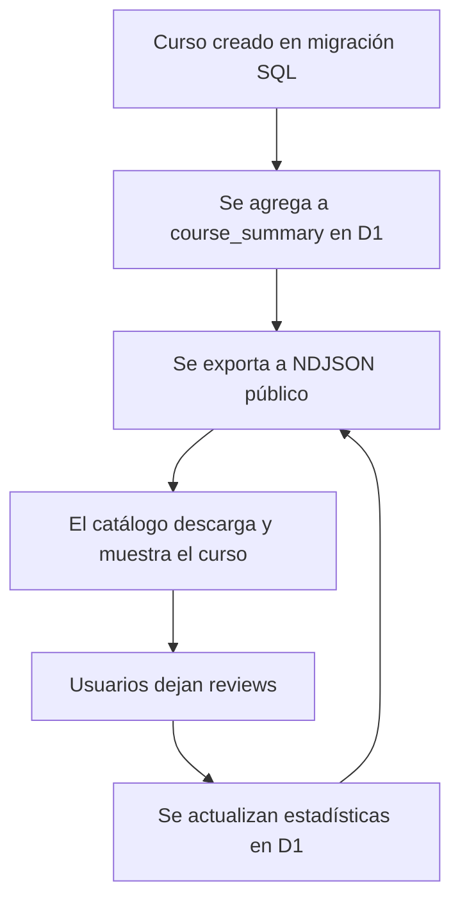

# ¿Cómo se almacenan, muestran y ordenan los cursos en BuscaRamos?

Esta sección explica, paso a paso y con ejemplos, cómo funciona el ciclo completo de los cursos en BuscaRamos: desde su almacenamiento en la base de datos, pasando por la visualización en el catálogo, hasta el ordenamiento según las reviews de la comunidad.

---

## 1. ¿Dónde y cómo se almacenan los cursos?

Los cursos se almacenan principalmente en la base de datos **D1** en la tabla `course_summary`. Cada curso tiene una sigla única y varios campos que resumen la información relevante y las estadísticas de las reviews.

**Ejemplo de estructura en SQL:**

```sql
CREATE TABLE course_summary (
  sigle TEXT PRIMARY KEY,
  likes INTEGER,
  superlikes INTEGER,
  dislikes INTEGER,
  votes_low_workload INTEGER,
  votes_medium_workload INTEGER,
  votes_high_workload INTEGER,
  votes_mandatory_attendance INTEGER,
  votes_optional_attendance INTEGER,
  avg_weekly_hours REAL,
  sort_index INTEGER
);
```

Los datos iniciales de cursos se cargan mediante migraciones SQL ubicadas en `migration/sql/courses/`. Cada archivo `.sql` inserta o actualiza cursos en la tabla `course_summary`.

**Ejemplo de migración:**

```sql
INSERT INTO course_summary (sigle, likes, superlikes, dislikes, ...)
VALUES ('INF1234', 0, 0, 0, ...)
ON CONFLICT (sigle) DO NOTHING;
```

Además, existe un archivo NDJSON público (`courses-score.ndjson`) que se utiliza para alimentar el catálogo de manera eficiente y escalable. Este archivo es generado por un endpoint que:

- Lee los cursos y sus estadísticas agregadas desde la base de datos (`course_summary`).
- Enriquece cada curso con información estática (nombre, créditos, requisitos, formato, campus, etc.) desde un archivo JSON (`cursos-simplificado.json`).
- Cada línea del NDJSON es un curso completo y enriquecido, listo para ser mostrado y filtrado en el catálogo.
- **No incluye reviews individuales ni comentarios extensos**, solo los datos agregados y la información estática necesaria para la navegación y búsqueda.

---

## 2. ¿Cómo se muestran los cursos en el catálogo?

El catálogo de cursos es accesible desde `/catalog` y está diseñado para ser rápido, interactivo y fácil de usar en cualquier dispositivo.

- El componente principal es `SearchableTableDisplay` (`src/components/features/catalog/SearchableTableDisplay.tsx`).
- Al cargar la página, este componente descarga y procesa el archivo NDJSON con todos los cursos y sus estadísticas.
- Los cursos se muestran en una tabla interactiva, con filtros por área, campus, unidad académica, formato, semestre, idioma y si es retirable.
- El usuario puede buscar por nombre, sigla o cualquier campo relevante.

**Flujo simplificado:**

1. El usuario accede a `/catalog`.
2. Se descarga el archivo NDJSON con los cursos y sus datos agregados.
3. El usuario puede buscar, filtrar y explorar los cursos en tiempo real.

---

## 3. ¿Cómo se ordenan los cursos según las reviews?

El orden de los cursos en el catálogo no es arbitrario: está influenciado por la actividad y valoración de la comunidad.

- Cada curso tiene estadísticas agregadas: cantidad de likes, superlikes, dislikes, votos de carga, tipo de asistencia, horas promedio, etc.
- El campo `sort_index` en la base de datos permite ajustar manualmente el orden si es necesario (por ejemplo, destacar cursos nuevos o relevantes).
- Por defecto, los cursos se ordenan por popularidad y valoración positiva, pero el usuario puede cambiar el criterio de orden (por ejemplo, por carga, por cantidad de reviews, por nombre, etc.) usando los controles de la tabla.
- El componente `ReviewSort` permite elegir el criterio de ordenamiento.

**¿Cómo se calculan las estadísticas?**

Cada vez que un usuario deja una review, los contadores y promedios del curso se actualizan automáticamente en la base de datos. Así, el catálogo siempre refleja la opinión colectiva y actualizada de la comunidad.

---

## 4. Ejemplo visual del ciclo de vida de un curso



---

## 5. Resumen de archivos y componentes clave

- **`migration/sql/courses/`**: Migraciones SQL para cargar y actualizar cursos.
- **`src/pages/catalog.astro`**: Página principal del catálogo.
- **`src/components/features/catalog/SearchableTableDisplay.tsx`**: Componente que muestra, filtra y ordena los cursos.
- **`src/components/features/courses/ReviewSort.tsx`**: Componente para elegir el criterio de ordenamiento.
- **`courses-score.ndjson`**: Archivo público con los datos agregados de cursos y reviews.
- **Base de datos D1**: Almacena la información y estadísticas de cada curso.

---

## 6. Preguntas frecuentes

**¿Por qué usamos NDJSON y no una API tradicional?**  
El formato NDJSON permite cargar y procesar grandes volúmenes de datos de manera eficiente en el navegador, sin sobrecargar el servidor y manteniendo la experiencia fluida.

**¿Qué pasa si un curso no tiene reviews?**  
Se muestra igualmente en el catálogo, pero aparecerá con estadísticas en cero o "sin datos suficientes".

**¿Por qué no aparecen los nombres de los profesores en las secciones?**  
Por normativa de la Ley N° 19.628 sobre Protección de la Vida Privada (Ley de Protección de Datos Personales) en Chile, no podemos mostrar ni publicar los nombres de los docentes asociados a cursos o secciones sin su consentimiento explícito. Esto protege la privacidad de los profesores y cumple con la legislación vigente.

**¿Cómo se asegura la actualización de los datos?**  
Cada vez que se deja una review, los datos agregados se actualizan en D1 y se reflejan en el próximo volcado NDJSON.

Esta arquitectura permite que el catálogo de BuscaRamos sea rápido, transparente y refleje la voz real de la comunidad estudiantil.
